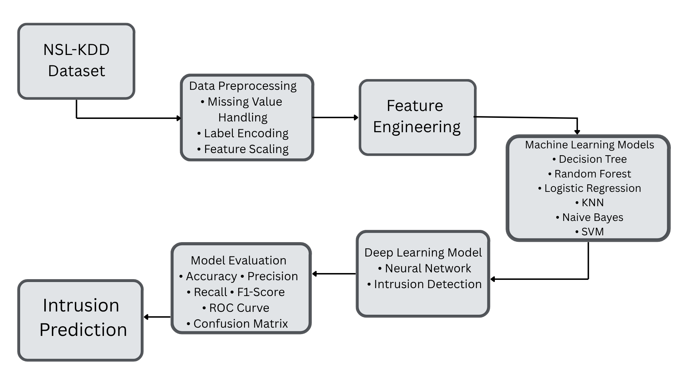
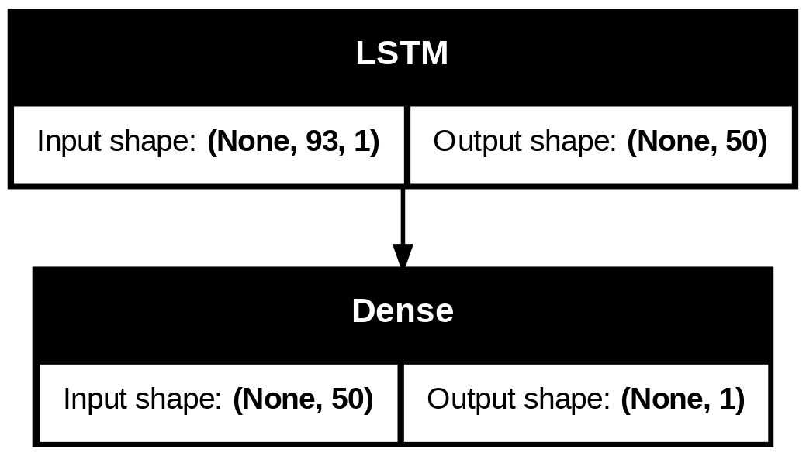
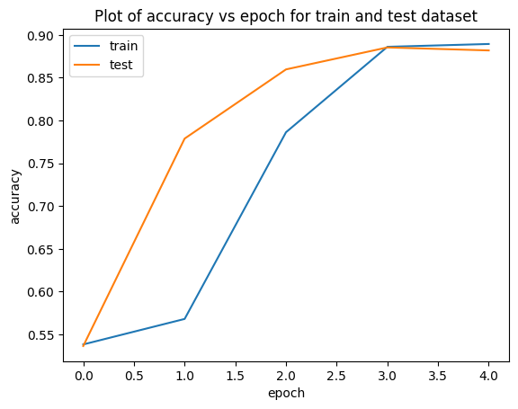
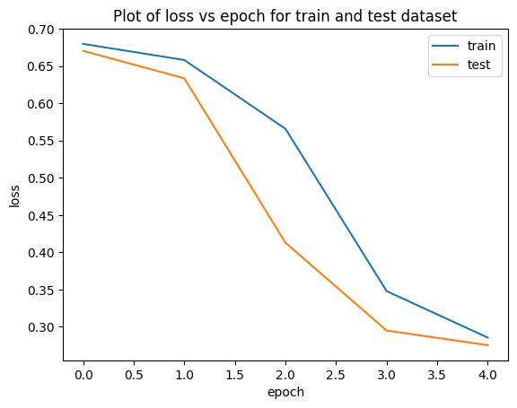
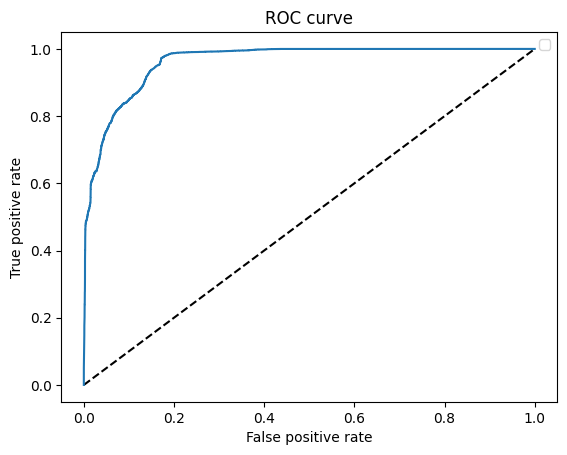

# 🛡️ Network Intrusion Detection System using Machine Learning & Deep Learning

A Network Intrusion Detection System (NIDS) built using Machine Learning and Deep Learning techniques on the **NSL-KDD** dataset. This project has been modernized to run seamlessly on **Google Colab**, **Python 3.12**, and **TensorFlow/Keras 3**.

---

## 📌 Project Overview

Network Intrusion Detection Systems are essential in cybersecurity for identifying malicious network traffic and protecting systems from unauthorized access.

This project implements an end-to-end intrusion detection pipeline that preprocesses network traffic data, trains multiple Machine Learning models, builds an LSTM-based Deep Learning model, and evaluates their performance using standard classification metrics.

---

## ✨ Features

* Data preprocessing and feature engineering
* Binary and multi-class intrusion detection
* Multiple Machine Learning classifiers
* LSTM-based Deep Learning model
* Model performance comparison
* ROC Curve and training visualization
* Google Colab compatible
* Python 3.12 and TensorFlow/Keras 3 compatible

---

## 🛠️ Technologies Used

* Python
* TensorFlow / Keras
* Scikit-learn
* Pandas
* NumPy
* Matplotlib
* Seaborn
* Google Colab

---

## 📂 Repository Structure

```text
Network-Intrusion-Detection-using-MachineLearning/
│
├── README.md
├── documentation.md
├── LICENSE
├── requirements.txt
├── .gitignore
│
├── Data_Preprocessing_NSL_KDD.ipynb
├── Classifiers_NSL_KDD.ipynb
├── Intrusion_Detection_NSL_KDD.ipynb
│
├── datasets/
│   └── README.md
│
├── images/
│   ├── workflow.png
│   ├── model_architecture.png
│   ├── training_accuracy.png
│   ├── training_loss.png
│   └── roc_curve.png
│
├── labels/
└── plots/
```

---

## 📖 Project Workflow



The workflow begins with the **NSL-KDD dataset**, followed by data preprocessing, feature engineering, training multiple Machine Learning models, building an LSTM-based Deep Learning model, evaluating performance, and finally predicting network intrusions.

---

## 🧠 Model Architecture



The Deep Learning model is based on an **LSTM network** followed by a Dense output layer for intrusion classification.

---

## 📊 Model Performance

### Training Accuracy



### Training Loss



### ROC Curve



---

## 📊 Dataset

This project uses the **NSL-KDD** dataset, a benchmark dataset widely used for evaluating Network Intrusion Detection Systems.

The dataset is **not included** in this repository due to its size.

Please download it separately and place it inside the `datasets/` folder before running the notebooks.

---

## 🚀 Getting Started

### Clone the Repository

```bash
git clone https://github.com/parishree-gupta/Network-Intrusion-Detection-using-MachineLearning.git
```

### Install Dependencies

```bash
pip install -r requirements.txt
```

### Run the Notebooks

Execute the notebooks in the following order:

1. `Data_Preprocessing_NSL_KDD.ipynb`
2. `Classifiers_NSL_KDD.ipynb`
3. `Intrusion_Detection_NSL_KDD.ipynb`

---

## 📈 Results

The implemented models are evaluated using multiple performance metrics, including:

* Accuracy
* Precision
* Recall
* F1-Score
* ROC Curve
* Confusion Matrix

These metrics help assess the effectiveness of the intrusion detection models in distinguishing normal and malicious network traffic.

---

## 🔄 Modernization

This repository has been updated from the original implementation to support the latest software ecosystem.

### Improvements

* ✅ Google Colab compatible
* ✅ Python 3.12 support
* ✅ TensorFlow/Keras 3 compatibility
* ✅ NumPy 2.x compatibility
* ✅ pandas 2.x compatibility
* ✅ Updated deprecated APIs
* ✅ Improved notebook execution and stability

---

## 💡 Future Enhancements

* Real-time packet capture
* Live intrusion detection dashboard
* Explainable AI (XAI)
* Docker deployment
* Cloud deployment
* REST API integration

---

## 👩‍💻 Author

**Pari Shree Gupta**

B.Tech Computer Science Engineering

Jaypee Institute of Information Technology

GitHub: https://github.com/parishree-gupta

---

## 📜 License

This project is licensed under the MIT License.

---

## ⭐ Support

If you found this project useful, consider giving it a ⭐ on GitHub!
